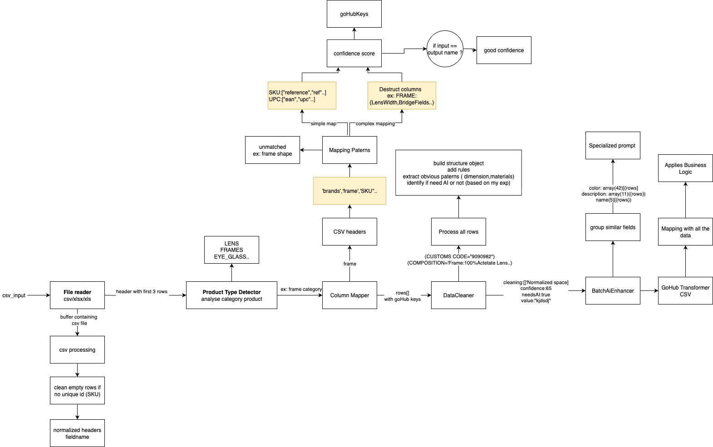

# CSV Converter AI - Complete Pipeline Flow Diagram

## Overview
The CSV Converter AI is a sophisticated data processing pipeline that converts raw CSV data into standardized GoHub format for eyewear products. The system uses AI enhancement, intelligent mapping, and data cleaning to transform unstructured data into structured product catalogs.

## Quick Start

### Prerequisites
- Node.js (version 14 or higher)
- npm package manager

### Installation
```bash
# Install dependencies
npm install
```

### Usage
```bash
# Start the CSV converter
npm run start
export OPENAI_API_KEY="your-api-key-here"
```

The application will process CSV files according to the configuration in `src/config/` and output the transformed data.

## Concise Flow Diagram

```
CSV Input → Type Detection → Column Mapping → Data Cleaning → AI Enhancement → GoHub Transform → CSV Output
    ↓              ↓              ↓              ↓              ↓              ↓              ↓
  Read File    Detect Type    Map Fields    Clean Data    Enhance AI    Structure    Generate CSV
```



### 6 Steps:
1. **CSV Reading** - Load & normalize data
2. **Type Detection** - Identify product type (LENS/FRAME/EYE_GLASSES)
3. **Column Mapping** - Map to GoHub schema
4. **Data Cleaning** - Apply rules & extract patterns
5. **AI Enhancement** - Batch process with OpenAI
6. **Output** - Generate GoHub CSV

### Key Features:
- Batch AI processing (60-80% cost reduction)
- Intelligent field mapping
- Business logic integration
- Error handling & validation

## Configuration
The application uses configuration files located in `src/config/`:
- `index.js` - Main configuration
- `mappingPatterns.js` - Field mapping patterns
- `schemas.js` - Data schemas

## Examples
See `src/examples/config-usage.js` for configuration examples and usage patterns.